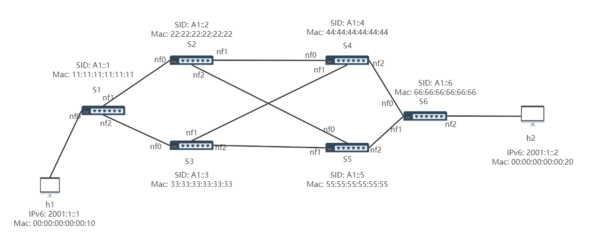

# SRv6-P4NetFPGA
## 1. Introduction
This is a project about SRv6 application, which can be 
used to steer traffic flows by you want. The project worked 
on the NetFPGA SUME platform. 

## 2. Environment
OS: Ubuntu16.04

Software Tools: Vivado 2018 + SDNet v2018.2

Hardware: NetFPGA SUME

## 3. Topology Test


Segment Policy: h1 -> s1 -> s2 -> s4 -> s6 -> h2

### 3.1 Test P4 Program

* Test source node s1
```
commands-src.txt


```
